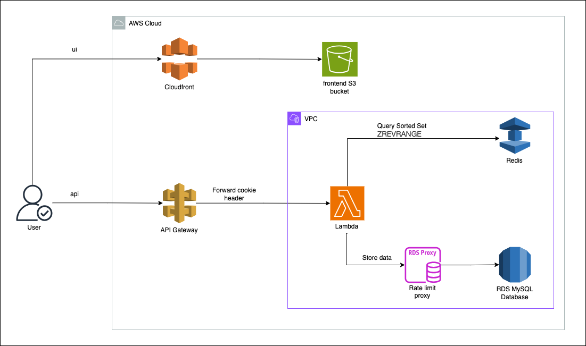

# Thanh_NC Problem 6

## Overview
A software module on the API service (backend application server)

## Requirements
1. We have a website with a score board, which shows the top 10 user’s scores:
   1. Website need to use websocket to perform realtime data stream the top 10 users scores.
   2. Score data will be stored in both redis cache and rds mysql database.
   3. Server query data from redis cache, with type `zrevrange` to get top 10 high scores.
2. We want live update of the score board.
   1. Upon redis data update, websocket will be triggered to update the user interface.
3. User can do an action (which we do not need to care what the action is), completing this action will increase the user’s score.
4. Upon completion the action will dispatch an API call to the application server to update the score.
5. We want to prevent malicious users from increasing scores without authorisation:
   1. User login to the system, system will validate user's data from the main rds database, then return a cookie contain session id to the user's browser and store session information into the redis cache.
   2. User request into the system with cookie header, web server get session id from cookie and get the current request user information from redis cache.
   3. Server will process the update with the session user information above.

## Flow diagram

## Improvement Comments
1. <b>Frontend</b>:
   - Use cloudfront + s3 to have a better performance globally.
2. <b>Backend</b>:
   - Architecture is mostly serverless (except RDS) to handle unknown traffic (spike traffic).
   - Each API will have a lambda function, map to the api gateway.
   - RDS Proxy will be used to limit the load and improve performance the main MySQL Database by limit the throughput rate.